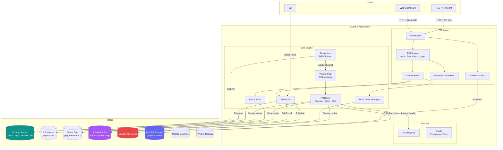
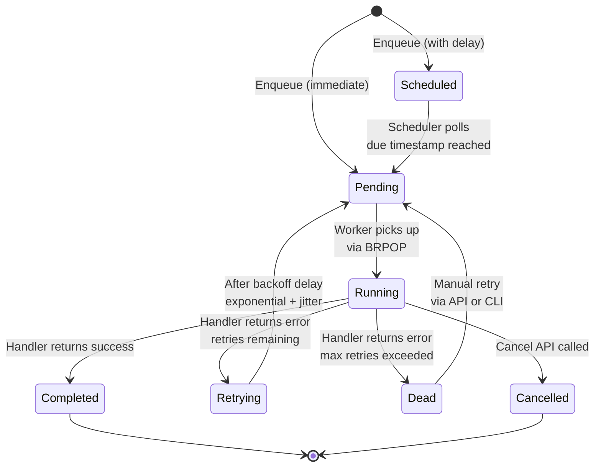
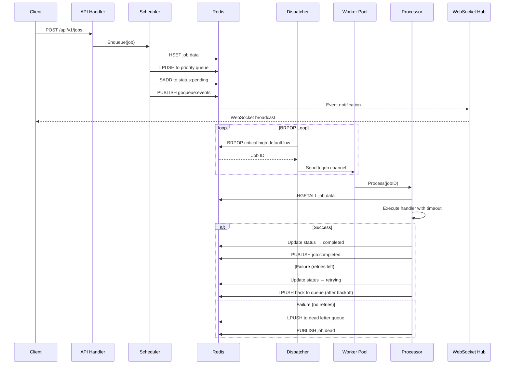
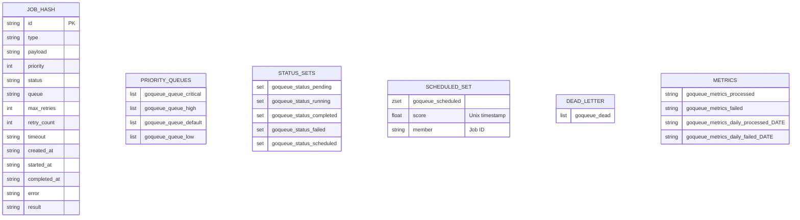
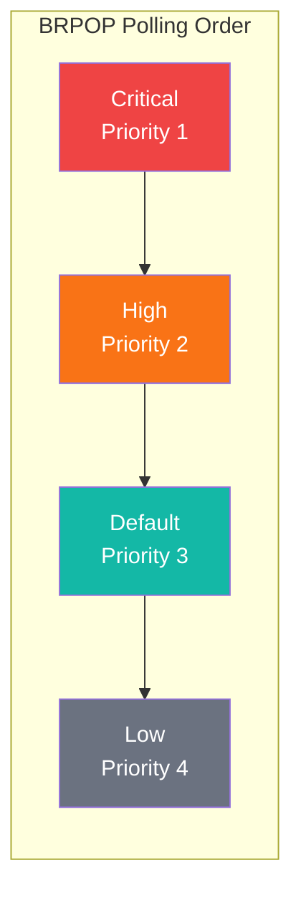
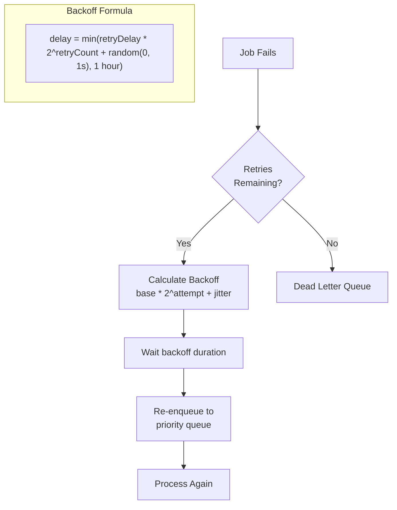

# GoQueue

A distributed task queue system built in Go with Redis as the message broker. Features priority queues, retry logic with exponential backoff, dead letter queue, real-time WebSocket updates, job scheduling, and a server-rendered dashboard.

## System Architecture



## Job Lifecycle



## Component Interaction Flow



## Redis Data Model



## Priority Queue Dispatch Order



The dispatcher uses Redis `BRPOP` across all four queues in priority order. Critical jobs are always dequeued first, ensuring high-priority work is never starved by lower-priority tasks.

## Retry Strategy



## Features

- **4-Level Priority Queues** — Critical, High, Default, Low with strict priority ordering via BRPOP
- **Exponential Backoff with Jitter** — Configurable retry delays that increase exponentially, capped at 1 hour
- **Dead Letter Queue** — Failed jobs after max retries are moved to DLQ for inspection and manual retry
- **Job Scheduling** — Submit jobs with a delay or specific execution time
- **Real-time Updates** — WebSocket-powered live notifications via Redis Pub/Sub
- **REST API** — Full CRUD for jobs with API key authentication and rate limiting
- **Web Dashboard** — Server-rendered UI with Go templates, HTMX, and Tailwind CSS
- **CLI** — Cobra-based CLI for job management, stats, and worker control
- **Graceful Shutdown** — In-flight jobs complete before process exit
- **Docker Ready** — Multi-stage Dockerfile + docker-compose for one-command deployment

## Project Structure

```
goqueue/
├── cmd/goqueue/
│   └── main.go              # CLI entry point (Cobra commands)
├── internal/
│   ├── broker/
│   │   └── redis.go          # Redis client, queue ops, pub/sub, metrics
│   ├── config/
│   │   └── config.go         # Environment-based configuration
│   ├── core/
│   │   ├── job.go            # Job model, priority/status types, serialization
│   │   ├── queue.go          # Engine orchestrator
│   │   ├── scheduler.go      # Job enqueue + scheduled job poller
│   │   ├── dispatcher.go     # BRPOP loop across priority queues
│   │   ├── worker.go         # Worker pool with heartbeat
│   │   ├── processor.go      # Job execution, retry logic, DLQ
│   │   ├── deadletter.go     # Dead letter queue operations
│   │   └── result.go         # Result store + job cancellation
│   ├── handlers/
│   │   ├── api.go            # REST API handlers
│   │   ├── dashboard.go      # Dashboard page handlers
│   │   └── ws.go             # WebSocket hub
│   ├── middleware/
│   │   ├── auth.go           # API key + Basic Auth
│   │   ├── logger.go         # Structured request logging
│   │   └── ratelimit.go      # Token bucket rate limiter
│   └── routes/
│       ├── routes.go         # Route setup + template functions
│       └── renderer.go       # Custom multi-template renderer
├── web/
│   ├── templates/
│   │   ├── layouts/
│   │   │   └── base.html     # Base layout with sidebar navigation
│   │   ├── pages/            # Dashboard pages (8 pages)
│   │   └── partials/         # HTMX partial templates
│   └── static/
│       ├── css/app.css       # Custom styles + badge classes
│       └── js/app.js         # WebSocket client + Chart.js
├── examples/                 # Example task handlers
├── Dockerfile                # Multi-stage build
├── docker-compose.yml        # App + Redis
├── render.yaml               # Render.com deployment blueprint
└── .env.example              # Environment variable reference
```

## Quick Start

### Docker (Recommended)

```bash
git clone https://github.com/Amitanand0123/goqueue.git
cd goqueue
docker-compose up --build
```

Open http://localhost:8080/dashboard (credentials: `admin` / `admin`)

### Local Development

Prerequisites: Go 1.24+, Redis 7+

```bash
# Start Redis
redis-server

# Run GoQueue
cp .env.example .env
go run ./cmd/goqueue start
```

## CLI Usage

```bash
# Start everything (API + workers + dashboard)
goqueue start

# Start API server only (no workers)
goqueue server

# Start workers only (no API)
goqueue worker --concurrency 20

# Submit a job
goqueue enqueue --type email:send --payload '{"to":"user@example.com"}' --priority high

# Check job status
goqueue status <job-id>

# List jobs
goqueue list --status completed --limit 10

# View queue stats
goqueue stats

# Retry all dead jobs
goqueue retry-dead

# Purge dead letter queue
goqueue purge-dead
```

## REST API

All API endpoints require the `X-API-Key` header.

| Method | Endpoint | Description |
|--------|----------|-------------|
| `POST` | `/api/v1/jobs` | Submit a new job |
| `GET` | `/api/v1/jobs` | List jobs (with filters) |
| `GET` | `/api/v1/jobs/:id` | Get job details |
| `DELETE` | `/api/v1/jobs/:id` | Cancel a job |
| `POST` | `/api/v1/jobs/:id/retry` | Retry a failed job |
| `GET` | `/api/v1/dead` | List dead letter jobs |
| `DELETE` | `/api/v1/dead` | Purge dead letter queue |
| `GET` | `/api/v1/stats` | Get queue statistics |

### Submit a Job

```bash
curl -X POST http://localhost:8080/api/v1/jobs \
  -H "Content-Type: application/json" \
  -H "X-API-Key: your-api-key" \
  -d '{
    "type": "email:send",
    "payload": {"to": "user@example.com", "subject": "Hello"},
    "priority": "high",
    "max_retries": 5,
    "timeout": "30s",
    "delay": "10s"
  }'
```

### Response

```json
{
  "id": "550e8400-e29b-41d4-a716-446655440000",
  "type": "email:send",
  "status": "pending",
  "priority": "high",
  "created_at": "2026-02-17T15:30:00Z"
}
```

## Dashboard Pages

| Page | Path | Description |
|------|------|-------------|
| Overview | `/dashboard` | Stats, charts, recent activity |
| Submit Job | `/dashboard/submit` | Browser-based job submission form |
| Queues | `/dashboard/queues` | Real-time priority queue depths |
| Jobs | `/dashboard/jobs` | Paginated job list with filters |
| Job Detail | `/dashboard/jobs/:id` | Full job info, payload, result |
| Scheduled | `/dashboard/scheduled` | Jobs waiting for their scheduled time |
| Dead Letter | `/dashboard/dead` | Failed jobs, retry/purge actions |
| Workers | `/dashboard/workers` | Active worker status + heartbeats |

## Configuration

All configuration is via environment variables:

| Variable | Default | Description |
|----------|---------|-------------|
| `PORT` | `8080` | HTTP server port |
| `ENVIRONMENT` | `development` | `development` or `production` |
| `API_KEY` | _(empty)_ | API key for REST endpoints |
| `REDIS_URL` | `localhost:6379` | Redis URL (supports `redis://` and `rediss://`) |
| `REDIS_PASSWORD` | _(empty)_ | Redis password |
| `REDIS_DB` | `0` | Redis database number |
| `WORKER_CONCURRENCY` | `10` | Number of worker goroutines |
| `WORKER_SHUTDOWN_TIMEOUT` | `30s` | Graceful shutdown timeout |
| `JOB_DEFAULT_TIMEOUT` | `30s` | Default job execution timeout |
| `JOB_DEFAULT_MAX_RETRIES` | `3` | Default max retry attempts |
| `JOB_DEFAULT_RETRY_DELAY` | `10s` | Base delay for retry backoff |
| `DASHBOARD_ENABLED` | `true` | Enable/disable dashboard |
| `DASHBOARD_USERNAME` | `admin` | Dashboard basic auth username |
| `DASHBOARD_PASSWORD` | `admin` | Dashboard basic auth password |

## Writing Custom Task Handlers

Register handlers with the engine before starting workers:

```go
engine.Register("notification:push", func(ctx context.Context, payload json.RawMessage) (json.RawMessage, error) {
    var p struct {
        UserID  string `json:"user_id"`
        Message string `json:"message"`
    }
    if err := json.Unmarshal(payload, &p); err != nil {
        return nil, err // non-retryable if payload is invalid
    }

    // Do the work (context carries job timeout)
    if err := pushNotification(ctx, p.UserID, p.Message); err != nil {
        return nil, err // will be retried based on job config
    }

    return json.Marshal(map[string]string{"status": "delivered"})
})
```

## Deployment

### Render

This project includes a `render.yaml` blueprint for one-click deployment:

1. Push to GitHub
2. Go to [Render Dashboard](https://dashboard.render.com) > **New** > **Blueprint**
3. Connect your repo and select the `render.yaml`
4. Render provisions the Go web service + Redis automatically

### Docker

```bash
docker-compose up --build -d
```

## Tech Stack

| Component | Technology |
|-----------|-----------|
| Language | Go 1.24 |
| Message Broker | Redis 7 (go-redis/v9) |
| HTTP Framework | Gin |
| Templates | Go html/template + HTMX |
| Styling | Tailwind CSS (CDN) |
| Charts | Chart.js |
| WebSocket | gorilla/websocket |
| CLI | Cobra |
| Container | Docker + Alpine |

## License

MIT
